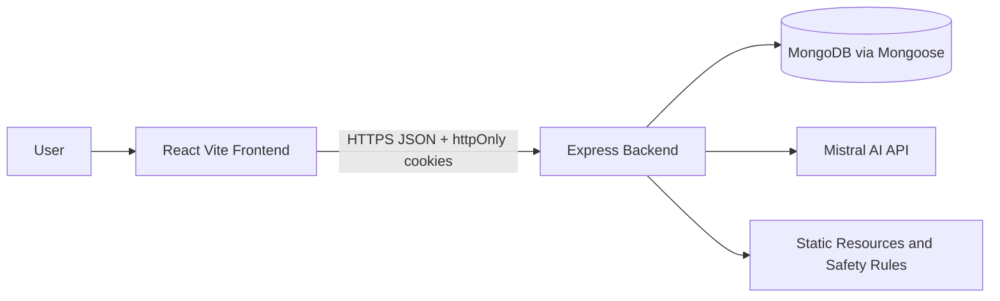

# System Architecture

## Overview

Kai uses a monorepo with an independently deployable React client and Express API. The client owns presentation and the breathing timer. The server owns authentication, authorization, crisis detection, Mistral access, validation, rate limiting, and persistence.



## Data flow

1. A user registers or signs in. The server hashes the password with bcrypt and issues short-lived access and refresh JWTs in httpOnly cookies.
2. The frontend sends credentials with Axios. Protected Express routes verify the access cookie and derive `req.user.id`; every query includes that user id.
3. Chat requests are validated and checked for crisis language before any AI call. Crisis messages are stored with a safety response and return a Resources navigation signal. Normal requests combine the system persona with the latest stored messages and call Mistral on the server.
4. The server first requests `mistral-large-latest`. A 429 response triggers `mistral-small-latest`. The API key is never sent to the client.
5. Mood and journal requests persist user-scoped documents in MongoDB. The client renders mood trends and private entries.

## Folder structure

```text
client/
  src/App.jsx       routes, auth shell, feature views
  src/api.js        Axios instance and refresh interceptor
  src/index.css     responsive accessible visual system
  src/affirmations.js
server/
  src/app.js        middleware and routes
  src/auth.js       registration, login, refresh, logout
  src/chat.js       safety check and Mistral integration
  src/models.js     User, Message, Mood, Journal schemas
  src/middleware.js auth guard and error boundary
  src/server.js     MongoDB connection and HTTP startup
  tests/            Jest and Supertest route tests
```

## ER model

```mermaid
erDiagram
  USER ||--o{ MESSAGE : owns
  USER ||--o{ MOOD : records
  USER ||--o{ JOURNAL : writes
  USER {
    objectId id PK
    string email UK
    string passwordHash
    string refreshTokenHash
  }
  MESSAGE { objectId id PK; objectId userId FK; string role; string content; date createdAt }
  MOOD { objectId id PK; objectId userId FK; string mood; string note; string date }
  JOURNAL { objectId id PK; objectId userId FK; string title; string content; date updatedAt }
```

## Safety boundaries

Helmet, locked CORS, route rate limits, express-validator, httpOnly cookies, and centralized friendly errors are applied at the API boundary. Sensitive content is deliberately excluded from production logs. The product does not diagnose or prescribe, and the Resources page is an always-available escalation path.
